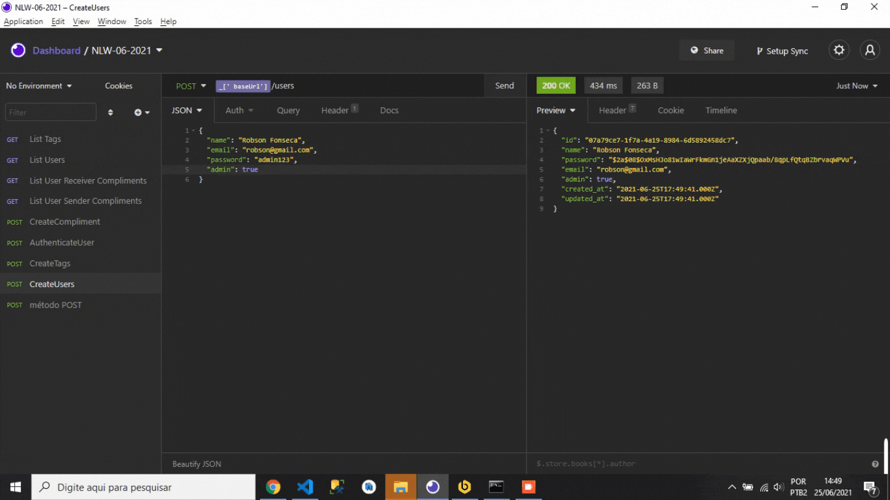

# nlwValoriza
Valoriza foi um projeto desenvolvido na NLW - Rocketseat o qual visa listar elogios e feedbacks para as pessoas. 

As <strong> regras de negócio</strong> desse sistema pressupõe que administradores cadastram elogios, listam usuários e elogios. 
 
Já os usuários recebem os elogios e só podem elogiar se estiverem autenticados no sistema e não podem elogiar a si mesmos. 

Nessa aplicação foram trabalhados vários conceitos: 
<ul>
    <li> Métodos HTTP </li>
    <li> Parâmetros </li>
    <li> Tipos de banco de dados (destaque para ORM) </li>
    <li> Código limpo </li>
    <li> Migrations com TypeOrm </li>
    <li> Midlewares </li>
    <li> Autenticação com JWT </li>
    <li> Sobscrever tipagem no express </li>
    
</ul>

As principais ferramentas foram *NodeJS, Express, Typescript, Banco de dados relacional ORM SQlite.* 

  

